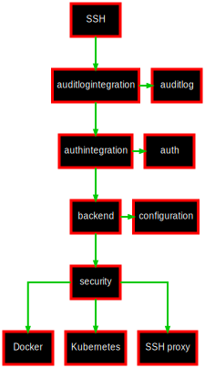

<h1>Internal Architecture</h1>

ContainerSSH is build as a [collection of libraries](https://github.com/containerssh), each of which is developed independently to ensure quality, but to the purpose of being integrated into what is ContainerSSH.

The core architecture consists of several [services](https://github.com/containerssh/service), such as [SSH](https://github.com/containerssh/sshserver) or the [metrics server](https://github.com/containerssh/metrics). These services are started from the [core code](https://github.com/containerssh/containerssh) as part of a service pool. If any one service fails the service pool shuts down.

One of the core services is the [SSH service](https://github.com/containerssh/sshserver), which creates a standardized, object oriented layer to deal with connecting SSH clients. It also abstracts away the complexities of SSH and the Go SSH library. This library defines a set of interfaces that **backends** need to implement.

The SSH backends are then added in **layers**. One of the most fundamental layers is [auditlogintegration](https://github.com/containerssh/auditlogintegration), which captures decoded SSH traffic and forwards it to the [audit log library](https://github.com/containerssh/auditlog).

The other critical layer is [authintegration](https://github.com/containerssh/authintegration), which forwards authentication requests to the [authentication library](https://github.com/containerssh/auth).

The final piece of the puzzle is the [backend library](https://github.com/containerssh/backend) which acts as a hub. As a first step it calls the [configuration library](https://github.com/containerssh/configuration) to obtain dynamic, per-user configuration. It then proceeds to load the [security layer](https://github.com/containerssh/security) and the appropriate backend, e.g. [Docker](https://github.com/containerssh/docker) or [Kubernetes](https://github.com/containerssh/kubernetes).

These backends form the lowermost layer of the SSH handler stack and forward the connections to the container backend.

## Module dependency map

The following graph shows the internal dependencies of ContainerSSH. This is important to know the order in which modules must be updated:

